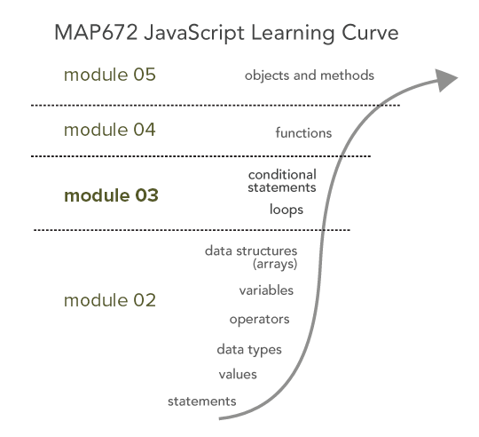

# Lesson 03: JavaScript Control Structures

## Goals

We will introduce JavaScript properties and methods that assess and affect our data structures. We will discover how to iterate through data and control the flow of execution in our program. We discuss some of the newer and more powerful features in the ever-evolving JavaScript specification in the addendum.

## Table of Contents

<!-- TOC -->

- [Lesson 03: JavaScript Control Structures](#lesson-03-javascript-control-structures)
    - [Goals](#goals)
    - [Table of Contents](#table-of-contents)
    - [Overview](#overview)
    - [JavaScript properties and methods](#javascript-properties-and-methods)
    - [Control structures and looping in JS programming](#control-structures-and-looping-in-js-programming)
    - [Control structures: the `if` and `else` statements](#control-structures-the-if-and-else-statements)
        - [Moving toward Lab 03](#moving-toward-lab-03)
    - [Addendum: Updates to JavaScript scripting language](#addendum-updates-to-javascript-scripting-language)
        - [`const` and `let` variables](#const-and-let-variables)
    - [Additional Resources](#additional-resources)
    - [Glossary](#glossary)

<!-- /TOC -->

## Overview 

In module 02, when we ran our script within our web browser (such as by hitting page refresh), our JavaScript executed from the top of the script to the bottom. This is to say, the "flow of program execution" moved in one direction, from top to bottom. However, often, we want to interrupt this flow of execution in various ways. This is where the idea of **control structures** comes into play. Within this lesson, we'll learn how we control the flow of our JavaScript program.

  
*JavaScript learning curve*


To begin, open the *lesson-03-data/index.html* Lesson 03 Starter template. Follow along with the lesson instructions, writing JavaScript code (toward the bottom of the document between the `<script></script>` tags) from the examples. You can comment out this code as you proceed through the lesson.

Save this file as you work, commit often, and push the changes back up to the module repository when completed. **This will constitute 10% of your lab 03 assignment grade,** in addition to the [*lab-03.md*](lab-03/lab-03.md) assignment.


## JavaScript properties and methods

Before we get into looping and control mechanisms, we need to briefly introduce a new key JavaScript term: that of a JavaScript *property*. For now, we can think of properties as similar to a variable in that they are used to store and retrieve a value or bit of information. The difference is that properties are attached to other objects, such as an array.

Properties are attached to arrays (and other data types) using a period, a convention known as *dot notation* or *dot syntax*. We're only going to talk about one array property now, that of `length`, which represents the number of values contained within an array. If we want to know the number of values in an array, we can access that value with `arrayName.length`.

For example, we derive the number of elements within the `cities` and `years` arrays using the `.length` property: 

```javascript
var cities = ["Frankfort", "Louisville", "Lexington"];
console.log(cities.length);  // output will be 3
var years = [2011, 2012, 2013, 2014, 2015, 2016];
var yearsNum = years.length;
console.log(yearsNum); // output will be 6
```

You should see `3` and `6` output to the console since the `cities` array has three values, and the `years` array has six.

Another important JavaScript term that we need to introduce now is what's known as a *method*. While we'll tackle JavaScript methods later in the course, we bring them up now to distinguish them from properties since we see them both with dot notation and objects. A method can change and manipulate an object's value, whereas a property reports a value.

Consider the above array and let's alphabetize it using the `arrayName.sort()` method.

```javascript
var cities = ["Frankfort", "Louisville", "Lexington"];
var citiesSorted = cities.sort();
console.log(citiesSorted); // outputs to ["Frankfort", "Lexington", "Louisville"]
console.log(cities); // also outputs to ["Frankfort", "Lexington", "Louisville"]
```

The statement `var citiesSorted = cities.sort();` changed the values in our original array and assigned that array to the variable `citiesSorted`.

The critical syntax difference between a property and a method is the use of the two parentheses `()` in the statement. Just like we've seen in QGIS Expression Builder and SQL, those parentheses indicate a function is at work. A method is a predefined function that operates, in our case, with the `sort()` method, on the array's values. This is an overly simplified description, and we will return to functions and methods in more detail.

While we're here, let's explore some more array properties and methods. The important thing to keep in mind is that properties and methods act differently on different data types. For example, we can use the JavaScript method `.toLocaleString()` on a number to convert it to a string and format it nicely with commas:

```javascript
var num = 123456.789;
var formattedNum = num.toLocaleString();
console.log(formattedNum); // "123,456.789"
```

The `.toLocaleString()` method needs to be attached to a number (not a string or an array).

Next, consider the `push()` method, which adds a new value at the end of the array. Because it acts upon arrays, it wouldn't make sense to use it with number or string types.

```javascript
var cities = ["Frankfort", "Louisville", "Lexington"];
cities.push("Covington");
console.log(cities); // outputs to ["Frankfort", "Louisville", "Lexington", "Covington"]
```

As we can see, the `.push()` method operates directly on the array, adding a new value to it. What if we tried to assign it to the new variable? Some methods "return" different values than the operation it performs on the object it is attached to. For instance, the `.push()` method both adds a new element to the array and returns an integer value of the new array length.

```javascript
var n = cities.push("Covington");
console.log(cities, n); // outputs to ["Frankfort", "Louisville", "Lexington","Covington"], 4
```

We can also insert a new value into an array by using the bracket notation and specifying the index value. We can use the `length` property to add a new value at the end of the array.


```javascript
var cities = ["Frankfort", "Louisville", "Lexington"];
cities[cities.length] = "Covington";
console.log(cities); // outputs to ["Frankfort", "Louisville", "Lexington", "Covington"]
```

Next, let's use the `.prompt()` function to allow the visitor to add values to an array. We'll need to assign a new variable to contain our input and then push it into our array.

```javascript
var cities = ["Frankfort", "Louisville", "Lexington"];
var userInput = prompt("Please enter a new city."); // The message inside the prompt is presented to visitor.
cities.push(userInput);
console.log(cities);
```

We'll be covering methods in more detail later on. For now, we'll be using the *length* property in the looping mechanisms below.


## Control structures and looping in JS programming

Looping is a common way of controlling the flow of execution of a script. The `for` loop is the most common (and often the computationally fastest) of the looping mechanisms. The below syntax of the for loop may look confusing at first, but it is widespread (first developed in the C programming language in 1972). You'll be using it frequently, so write it into your script and study it carefully, as well as the output in the JavaScript Console:

```javascript
console.log("before the for loop");
for (var i = 0; i < 5; i++) {
  console.log(i); // outputs numbers from 0 to 4
}
console.log("after the for loop");
```

An opening and closing parentheses follow the 'for' statement (a reserved keyword in JavaScript). Within the parentheses are three expressions, separated by semicolons:

1. First, we declare a variable named `i` (which generally stands for *integer*) and assign it a value of zero (`var i = 0;`). This expression initializes, or begins, a counter variable (a variable that counts).
2. Second, following the first semicolon is the next expression `i < 5;` which checks to see if the value of i is less than 5 (in this case). If that expression is true (i is less than 5), then:
3. Third, the final expression (`i++`) is executed. If not, the looping mechanism stops. The `i++` expression uses an operator we haven't seen yet, the double plus sign `++`. This operator is equivalent to `i = i + 1` and is merely a quick way of adding 1 to a current numeric value. The third, final expression within the parentheses, therefore, acts to increment the counter variable.

Thus, the loop will continue to execute the statements contained within the curly brackets `{` and `}` (what's known as a **block statement**) until the expression contained within the parentheses resolves to false. In this case, this happens when `i` is no longer less than 5. The program then will continue to the next line of code below the for loop (`console.log("after the for loop");`).

Note that the use of `i` here is arbitrary. We could just as well use another variable name, such as `number` or `count`:

```javascript
for (var number = 0; number < 5; number = number + 1) {
  console.log(number); // outputs numbers from 0 to 4
}
```

In this example, instead of using the shorthand `i++`, we've written the equivalent in a longer form (`number = number + 1`).

We often use `for` loops in JavaScript by looping through values of an array. To do this, we'll use the length of the array (how many values are in an array) within the second expression to determine how long the loop should continue. Study this code and its output carefully, particularly what's happening inside the `for` loop's block statements. Think about the flow of execution as the loop progresses through incrementing the value of i, and how the variable i is used to access the index values of the array using the bracket notation. This is a classic for loop in computer science, and one you'll get to know well. **Be sure to understand this one conceptually!**

```javascript
var cities = ["Frankfort", "Louisville", "Lexington"];
for (var i = 0; i < cities.length; i++) {
    console.log(i); // output the current value of i
    console.log(cities[i]); // use i to access an index of the Array
}
```

Alternatively, we could use a for loop to construct an array of integers from 1 to 10.

```javascript
var newArray = []; // define an empty Array
for(var i = 0; i < 10; i++) {
    newArray[i] = i + 1;
}
console.log(newArray); // output will be [1, 2, 3, 4, 5, 6, 7, 8, 9, 10];
```

Finally, we can get even trickier and have a nested looping structure (a loop within a loop)!

```javascript
for (var i = 0; i < 5; i++) {
  console.log('outer loop: ' + i);
  for (var j = 0; j < 5; j++) {
    console.log('inner loop: '+ j);
  }
}
```

Study this structure carefully, and in your mind imagine the "flow of execution" as the program loops once through the outer for loop, but then five times through the inner loop, then for a second time through the outer loop, then again five times through the inner loop, and so on.

A classic type of test question in a Computer Science department may ask you to, with pencil and paper, determine the value of sum that's logged to the Console in this example:

```javascript
var sum = 0;
for (var i = 0; i < 5; i++) {
  for (var j = 0; j < 5; j++) {
    sum += j;
  }
  sum += i;
}
console.log(sum);  // output will be 60.
```

We're not going to do things like that because we're more interested in having fun with our examples to make maps. But still, this is the kind of logical thinking you should begin to practice as you write code.

Read more about the [for statement](https://developer.mozilla.org/en-US/docs/Web/JavaScript/Reference/Statements/for) and the [JavaScript For Loop](http://www.w3schools.com/js/js_loop_for.asp). Later in the semester we'll explore new variations of the `for` loop.

An alternative to the classic `for` loop in JavaScript is the `while` loop. This loop works similarly as the `for` loop, though the syntax is different. There is only one expression within the parentheses, and as long as it resolves to `true`, the loop will continue. Note that we declare and assign the variable of `i` externally to the looping structure itself (the `var i = 0;` line), while `i` is incremented within the block statement itself (the `i++` statement):

```javascript
var cities = ["Frankfort", "Louisville", "Lexington"];
var i = 0;
while (i < cities.length){  
    console.log(i);
    console.log(cities[i]);
    i++        
}
```

The while loop in this example operates precisely like for loop above. Generally speaking, you'll use a for loop when you know how many times you want to loop, such as for the number of elements in a dataset. You'll use a while loop when the value used in the expression is unknown (which, may not make sense given these simple examples, but will become more evident in more complex programs).

Note that JavaScript is a very flexible language, and you may see examples of loops that do not use the curly braces. It is, however, good practice to use them and is recommended within this course.

Read more about the [while statement](https://developer.mozilla.org/en-US/docs/Web/JavaScript/Reference/Statements/while) and the [JavaScript While Loop](http://www.w3schools.com/js/js_loop_while.asp).

Finally, since we mentioned methods above, it's worth mentioning that there are some newer JavaScript methods useful for looping through arrays. The `.forEach()` method is one of these and acts just like the `for` and `while` loops above:

```javascript
var cities = ["Frankfort", "Louisville", "Lexington"];
cities.forEach(function(city, i) {
    console.log(city, i); // Frankfort 0 , Louisville 1, Lexington 2
});
```

Again, if methods seem overly confusing at this point, don't worry too much about them for now. 

## Control structures: the `if` and `else` statements

The `for` and `while` statements introduced above allow us to disrupt the normal flow of the program execution. Rather than just executing statements from the top of the script to the bottom, the program will loop before continuing. **If and else statements** allow for even further control over the flow of the program and play very nicely with looping.

The syntax is similar to that of the `for` and `while` loops. Write and test the following code:

```javascript
var temp = 32;
if(temp === 32) {
   console.log('the temperature is freezing');
}
```

1. First, the statement `if`,
2. followed by an opening and closing parentheses that contain an expression that evaluates to either true or false,
3. followed by block statements contained within curly braces.

If the expression evaluates to true, the block statements are executed.

Because the number `32` is equivalent to the value of `temp`, the expression evaluates to true, and the *console.log* statement within the braces is executed. Again, pay attention to how a single equal sign is used `=` to assign a value to a variable, and a triple equal sign is used `===` to test if two things are equal.  

Try changing the value of `temp` to 33 and rerunning the code.

```javascript
var temp = 33;
if(temp === 32) {
   console.log('the temperature is freezing');
}
```

There is no output! However, the program ran successfully because the conditional expression evaluated to false, and therefore the statements within the curly braces did not execute. However, it'd be nice if we knew this. Let's include another statement, the *else* statement. Else statements just follow an *if* statement.

```javascript
var temp = 33;
if(temp === 32) {
   console.log('the temperature is freezing');
} else {
    console.log('the temperature is NOT 32, but still may be freezing');
}
```
In this case, the conditional statement evaluates to false, and the code within the `else` block statement runs, rather than within the `if` block statement.

Often we want to test more than one condition before executing the  `else` block statement. We can add subsequent *else if* statements after the first `if` statement and before a final *else* statement. The comments within this example help explain how the if, else if, and else statements work.

```javascript
var temp = 33;
if(temp <= 32) {
    console.log('the temperature is freezing');
} else if(temp > 32) {
    console.log('the temperature is above freezing');
} else {
    console.log('the value of temp must not be a number');
}
```

`If` and `else` statements are useful by themselves. But they're more powerful when using them inside looping mechanisms. Consider the following code:

```javascript
for(var i = 0; i <= 10; i++) {
    if(i === 5) {
        break;
    }
    console.log(i); // out will be 0 1 2 3 4
}
```

Often when we loop, we're looking for a conditional statement to evaluate to true, but we no longer need the loop to continue once that condition has been met. In this case, we'll use a particular statement known as a *break* statement to "break" out of the loop, thereby returning the flow of execution of the script to its normal course. Within this example, the JavaScript will loop through each number, starting at zero, until the incremented value of `i` equals five. At that point, the condition within that `for` loop is true, and the `break` statement within the `for` loops block statement ends the loop.

**Question:** How is the output different if the `console.log(i)` statement executes before the `if` statement?

Next, let's say we have an array of city names, and we have the name of a particular city stored as a variable. We want our code to test whether or not that city name is contained in the array. We can use a loop and an *if* statement to perform this test:

```javascript
var cities = ["Frankfort", "Louisville", "Lexington"];
var testCity = "Louisville";
for (var i = 0; i < cities.length; i++) {
    if(cities[i] == testCity) {
        console.log(`${testCity} is found in the city Array!`);
    }
}
```

Furthermore, we could use the loop to tell us where in the array that the city is found. Write this JavaScript code and examine the output in your Console.

```javascript
var cities = ["Frankfort", "Louisville", "Lexington"];
var testCity = "Louisville";
for (var i = 0; i < cities.length; i++) {
    if(cities[i] == testCity) {
        console.log(`${testCity} is found in the city Array at index ${i}!`);
    }
}
```

Following from the previous simple examples, we can include an `else` statement to let us know that the value hasn't been found within the array:

```javascript
var cities = ["Frankfort", "Louisville", "Lexington"];
var testCity = "Bowling Green";
for (var i = 0; i < cities.length; i++) {
    if(cities[i] == testCity) {
        console.log(`${testCity} is found in the city Array at index ${i}!`);
    } else {
        console.log(`${testCity} was not found within the Array at index ${i}!`);
    }
}
```

We can use a `break` statement to end the looping when a certain condition is met: 

```javascript
var years = [2008, 2009, 2010, 2011, 2012, 2013, 2014, 2015];
for(var i = 0; i < years.length; i++) {
  if(years[i] == 2012) {
    break;
  } else {
    console.log(years[i]);
  }
}
```

This loop will log to the console the values within the array until it finds one that matches the number 2012. The `break` statement then "breaks" out of the loop, and the program continues to execute statements below the looping structure.

Read more about [if/else statements](https://developer.mozilla.org/en-US/docs/Web/JavaScript/Reference/Statements/if...else) and [JavaScript If ... Else Statements](http://www.w3schools.com/js/js_if_else.asp).


### Moving toward Lab 03

The following examples will better prepare you for the Lab 03 assignment. First, create two arrays. One will contain the string values for names of cities. The other will be the populations of these cities. Note that the order of the two arrays must correspond with one another.

Then write a `for` loop to iterate through all the elements in the `cities` array. You can access the elements of each array using the incrementing `i` variable. Run the code and study the output in the Console.

```javascript
var cities = ["Lexington", "Louisville", "Frankfort"];
var cityPops = [308428, 756832, 25527];

for (var i = 0; i < cities.length; i++) {
  console.log(cities[i]);
  console.log(cityPops[i]);
}
```

Note that you can modify this to first store the value to a variable, and then log it to the console.

```javascript
var cities = ["Lexington", "Louisville", "Frankfort"];
var cityPops = [308428, 756832, 25527];

for (var i = 0; i < cities.length; i++) {
    var cityName = cities[i]
    console.log(cityName)
    var cityPop = cityPops[i];
    console.log(cityPop);
}
```

Furthermore, you can use these variables within the loop in various ways. For instance, you can concatenate them together with other string values to produce a single output statement of the name and population.

```javascript
var cities = ["Lexington", "Louisville", "Frankfort"];
var cityPops = [308428, 756832, 25527];

for (var i = 0; i < cities.length; i++) {
    var cityName = cities[i];
    var cityPop = cityPops[i];
    var nameAndPop = `${cityName} population: ${cityPop}`;
    console.log(nameAndPop);
}
```

Once we understand how the loop is building our variables, we can remove the extra declarations and trim our code down if we are concerned about the file size of your page.

```javascript
var cities = ["Lexington", "Louisville", "Frankfort"];
var cityPops = [308428, 756832, 25527];

for (var i = 0; i < cities.length; i++) {
    var nameAndPop = `${cities[i]} population: ${cityPops[i]}`;
    console.log(nameAndPop);
}
```

Study these examples carefully as they help you solve the challenge for Lab 03.

## Addendum: Updates to JavaScript scripting language

Since 2015, the [ECMAScript specification](https://en.wikipedia.org/wiki/ECMAScript) for Javascript has been updated each year to incorporate new features and syntax that improve performance and readability. The newest specification is the 10th Edition (known as ES2019), but browsers support the specifications differently. 

These new specifications introduce many helpful features and techniques that are favored over the techniques we use now. While our techniques will likely never become obsolete, we should occasionally peek at how the new specs might change how we write code. 

### `const` and `let` variables

We have extensively used the `var` keyword to declare and assign variables. These variables are globally accessible in the way that we've used them. This can prove tricky in larger applications or with temporary variables. Consider the bit of code we've been using to iterate through our city arrays. The `i` and `nameAndPop` variables are temporary, i.e., they are only used in the `for` loop. But, after our loop runs, they are still defined. Ideally, we would dispose of these variables after they are used. (Also note how the `nameAndPop` variable is built.)

```javascript
var cities = ["Lexington", "Louisville", "Frankfort"];
var cityPops = [308428, 756832, 25527];

for (var i = 0; i < cities.length; i++) {
    var nameAndPop = `${cities[i]} population: ${cityPops[i]}`;
    console.log(nameAndPop);
}

console.log(i, nameAndPop); 
// returns the last iteration and is available everywhere
```

The `let` and `const` [variables](https://wesbos.com/let-vs-const/) remove this potentially confusing situation. The `const` variable is short for *constant* variable. Once a `const` variable is made, it can not be re-declared or have its existing value changed. Though, its properties can change, such as an array with new values added. Let's consider some examples.

```javascript
const cityPops = [308428, 756832, 25527];

// Re-declaring this variable is not permitted
const cityPops = [308428, 756832, 25527, 44524];
// or 
cityPops = [308428, 756832, 25527, 44524];
// both of these will throw an error.

// Adding new values into the array is allowed
cityPops.push(44524);
cityPops[4] = "Adding new values!"
console.log(cityPops)
```

The `const` variable ensures that, once declared, it remains the same data type (string, array, etc.) and only it's properties can change. For example, you can push new values into an array. 

What if you need to have a value change temporarily, like in a `for` loop? We'll use the `let` variable declaration. 

```javascript
const cities = ["Lexington", "Louisville", "Frankfort"];
const cityPops = [308428, 756832, 25527];

for (let i = 0; i < cities.length; i++) {
    let nameAndPop = `${cities[i]} population: ${cityPops[i]}`;
    console.log(nameAndPop);
}
console.log(nameAndPop); // Returns an error. This is good!
```

Why would returning an error be good? In our case, we have *let* the variable `nameAndPop` be used within our loop, but not outside of it. The same error would be thrown if we `console.log()` the `i` variable. We can reuse those variable names again without error or conflict with other variables. 

When used inside curly brackets `{}`, a *block* of code, both `let` and `const` variables are limited to that block. We call this *block scope* and helps fence in variables and prevent rewriting variable values. We cannot re-declare `const` and `let` variables in the same scope, which protects variables from unintentional change. (We'll talk more about the scope of variables in the module on functions.) 

Consider the following code where we use existing variables inside a `for` loop block. Because they're used inside the block, they're limited to only that block and prevent overwriting the existing variable values.

```javascript
const cities = ["Lexington", "Louisville", "Frankfort"];
const cityPops = [308428, 756832, 25527];
const i = 23; // my fav number
const name = "Monkey's Eyebrow"; // my fav Ky city name
for (let i = 0; i < cities.length; i++) {
    let name = `${cities[i]} population: ${cityPops[i]}`;
    console.log(name);
}
console.log(i, name); // preserves the const variable values
```

If we used the `var` declaration, then the original variable values are lost. Not good! Of course, if you are observant about using unique variable names, you should be okay. The problem is more likely to arise in more complex code bases with multiple contributors. It takes only one variable reassignment to wreak havoc.

```javascript
const cities = ["Lexington", "Louisville", "Frankfort"];
const cityPops = [308428, 756832, 25527];
var i = 23; // my fav number
var name = "Monkey's Eyebrow"; // my fav Ky city name
for (i = 0; i < cities.length; i++) {
    let name = `${cities[i]} population: ${cityPops[i]}`;
    console.log(name);
}
console.log(i, name); // 😒
```

To summarize the use of `const` and `let` variables, think of the "strength" of your declaration. The `var` declaration is *weak* because the variable could be reassigned anywhere in your script. Compare that to a *strong* `const` declaration, which cannot be redeclared or reassigned in the same scope though its properties can change. The `let` declaration is also *strong* because, while it can be reassigned in the same scope, it cannot be redeclared. 

Using `const` and `let` variables will help you work in larger projects that import JS libraries (like Leaflet.js later in the course) by preventing the reassignment or redeclaration of variables in the same scope. 

## Additional Resources

* Read the sections on "Control Flow" in Chapter 2 of Haverbeke (2014) [Program Structure](http://eloquentjavascript.net/02_program_structure.html)
* Read more about [for loops](https://developer.mozilla.org/en-US/docs/Web/JavaScript/Reference/Statements/for), [while loops](https://developer.mozilla.org/en-US/docs/Web/JavaScript/Reference/Statements/while), [if/else statements](https://developer.mozilla.org/en-US/docs/Web/JavaScript/Reference/Statements/if...else), and [array methods](https://www.w3schools.com/js/js_array_methods.asp)
* Quick [JS reference](https://www.w3schools.com/js/js_let.asp) at w3schools.com


## Glossary

* **property**: when used with an Array, stores information about that Array, such as its length
* **dot notation or dot syntax**: the use of a period to concatenate a property or method to an object
* **control structure**: the use of looping mechanisms and conditional statements (e.g., if/else) to control the flow of a program's execution
* **for loop**: a looping structure that iterates a counter variable until a given expression is no longer resolve as true
* **while loop**: a looping structure that continues until a given expression is evaluated as false
* **if statement**: executes a statement (or block statement) if a specified condition is true
* **else statement**: executes a statement (or block statement) if a previous `if` condition does not evaluate to true
* **break statement**: a statement that breaks the flow of a program's execution from the  looping structure and returns to the normal flow
