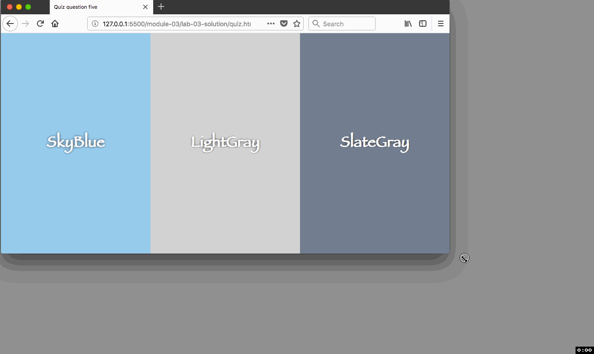
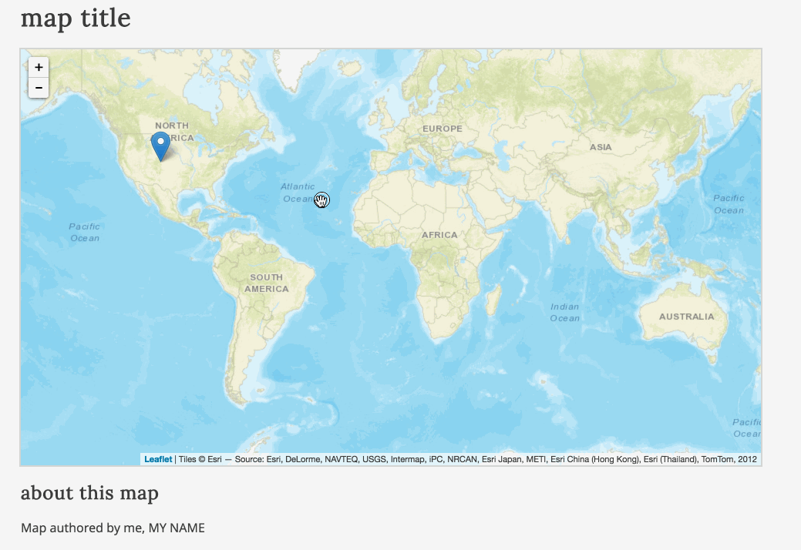
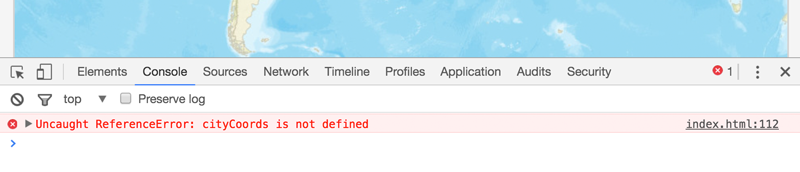
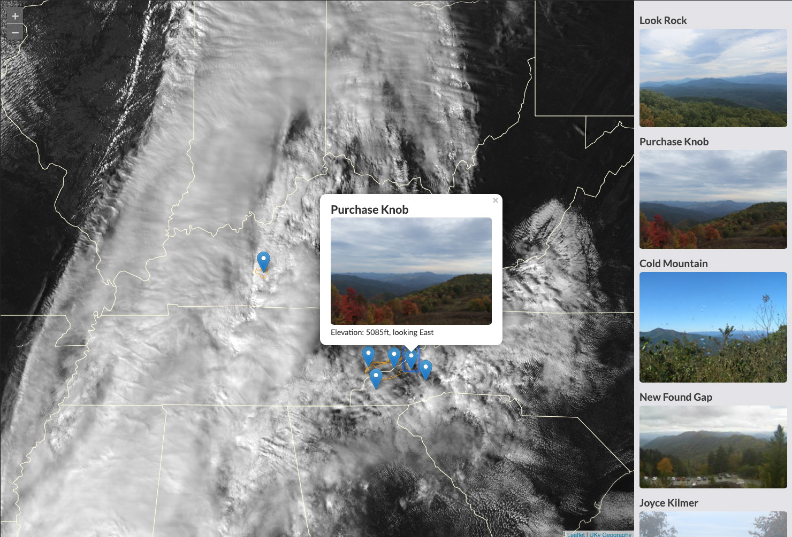

# Lab 03: JavaScript Arrays and Control Structures

## Table of Contents

<!-- TOC -->

- [Lab 03: JavaScript Arrays and Control Structures](#lab-03-javascript-arrays-and-control-structures)
    - [Table of Contents](#table-of-contents)
    - [Part I. Understanding the lesson (1 point)](#part-i-understanding-the-lesson-1-point)
    - [Part II. Understanding the lesson (3 point quiz)](#part-ii-understanding-the-lesson-3-point-quiz)
    - [Part III. Controlling the flow of our map script (6 points)](#part-iii-controlling-the-flow-of-our-map-script-6-points)
    - [Challenge. Add webcam stations to satellite map (+1)](#challenge-add-webcam-stations-to-satellite-map-1)
    - [Final submission](#final-submission)

<!-- /TOC -->

## Part I. Understanding the lesson (1 point)

Read through the lesson *README.md* and use the *lesson-03/index.html* file to write/execute the statements presented in the lesson. You can, of course, comment out statements that you're already completed. Commit changes as you go and finally push the index.html to your GitHub repo.

## Part II. Understanding the lesson (3 point quiz)

Create a new file named *quiz-03.md* within your *map672-module-03-username/lab-03/* directory.

Answer the following questions and save them to the *quiz-03.md* file. Commit the file to your repository with a good commit message.  Hint: write or copy/paste code within your lesson `<script></script>` tags to look for errors, test, and puzzle out wa solution. 

Also, refer to the [Markdown syntax guide](https://help.github.com/articles/basic-writing-and-formatting-syntax/) to appropriately format both your text responses and the code. Each answer is worth 0.5 points.


 1. Using the provided array :
    ```js
    var weekDay = ["Monday", "Tuesday", "Wednesday", "Thursday", "Friday"]
    ```

    write a `for` loop that logs to the console the following four lines:

    ```text
    A day of the week is Monday.
    A day of the week is Tuesday.
    A day of the week is Wednesday.
    A day of the week is Thursday.
    ```
 2. Modify the below nested `for` loops using array bracket notation to log to the console the contents of `myArray`.

    ```javascript
    var myArray = [
        [41,45,95],
        [32,52,87]
    ]

    for (var i = 0; i < myArray.length; i++) {
        console.log(`i: ${i}`)
        for (var j = 0; j < myArray.length; j++) {
            console.log(`j: ${j}`)
        }
    }
    ```
    Example output: 
    ```txt
    41
    45
    95
    32
    52
    87
    ```
 3. Why would you use a `for` loop instead of a `while` loop? Note: it's okay to Google for this answer. [Stack Overflow](http://stackoverflow.com/) is a great resource!
  
 4. Write a loop that stops executing when a person types the word "Hi!" (without quotes). Complete the following code snippet. 

    ```js
    var input = ''
    // Start loop here
    input = prompt('Please tell me something');
    ```
 5. The following script is supposed to loop through the numbers and log to console the number if that number multiplied by itself equals 25. But there is an error when the script runs. Debug the following code snippet. 

    ```javascript
    var nums = [1,2,3,4,5,6];
    for(var i = 0; i < nums.length; i++){
        if(25 = nums[i] * nums[i]){
            console.log(i);
        }
    }
    ```

 6. We can use CSS and JavaScript to produce content in the browser dynamically. Suppose we wanted three columns that evenly spanned a browser page. Evan column has a different color with the name of that color centered in the column. The page should respond similarly to:

      
    *Example of correct output*

    The following web page needs two changes to make this page act like the above example. One addition is a [`float` property](https://www.w3schools.com/css/css_float.asp) to a CSS rule, and the other is adding a [`+=` operator](https://www.w3schools.com/js/js_operators.asp) in JavaScript. Correct the code in your *lab-03/quiz-03.html* document. Feel free to change the colors to more harmonious hues.

    ```html
    <!DOCTYPE html>
    <head>
        <meta charset=utf-8 />
        <title>Quiz question six</title>
        <meta name='viewport' content='initial-scale=1,maximum-scale=1,user-scalable=no' />

        <style>
            body {
                margin: 0;
                padding: 0;
            }

            #quiz {
                width: 100%;
                height: 100vh; /* 100% vertical height */
                background-color: orange;
            }

            #quiz div {
                width: 33.33%;
                height: 100vh;
                text-align: center;
            }

            #quiz div h1 {
                margin-top: 40vh; /* Push heading element down 40% of total height */
                color: white;
                font-family: fantasy;
                text-shadow: 0px 0px 6px #333;

            }
        </style>
    </head>

    <body>

        <div id="quiz"></div>

        <script>
            var colorName = ["SkyBlue", "LightGray", "SlateGray"];
            for (var i = 0; i < colorName.length; i++) {
                document.querySelector("#quiz").innerHTML = 
                `<div style='background-color: ${colorName[i]};'>
                <h1>${colorName[i]}</h1></div>`;
            };
        </script>
    </body>

    </html>
    ``` 

## Part III. Controlling the flow of our map script (6 points)

Modify *lab-03/index.html* (or use the *index.html* you created in Lab 02) to fulfill the requirements listed below. You will need first to add the HTML and CSS you created in the first module to finish this template. 

The goal of this lab is to update the code written in Lab 02 to again place three markers on the map for three different cities and provide popup information about their relative population sizes. However, we want to make the code less redundant by using arrays and looping structures, rather than separate variables for each respective city.

Launch the *lab-03/index.html* Starter Template file using Live Server. You'll notice the map doesn't load. Why? We haven't 'hooked up' Leaflet's JS and CSS libraries, and modified the document to show a map.

To resolve this, you can pull in the code you made for your template page. Or, you can visit [Leaflet's download page](https://leafletjs.com/download.html) to find the latest hosted version to include. For your map ID style, I suggest using `vh` units to display your map's height based on the viewport height.

```css
#map {
    width: 100%;
    height: 60vh;
}
```

Save your document and you should see a page similar to the below page.

  
*The initial view of the Starter Template file*

Before we begin this lab, let's look carefully at the JavaScript code that is provided. While we won't get into really understanding what all the Leaflet code is doing until Module 07, we can begin to get a basic sense of how this web map is working. Let's break this code down.

The JavaScript begins by creating a new variable named `options` and assigns a complicated looking bit of code to it. This is a JavaScript object (contained within the two `{ }` curly braces), but we won't get into objects until Module 06.

What's important for now is that we should already recognize a couple of the values written within it.

```javascript
var options = {
    center: [0, 0],
    zoom: 2
}
```
The `[0, 0]` following the word `center` is an array, the first value being the latitude of the center of the map, and the second being the longitude. The number `2` following `zoom` is the initial zoom level. We can easily deduce this because the Leaflet API was written with semantically meaningful terms.

The next bit of code creates a Leaflet map using these options, requests some base map tiles, and adds it to the map. The `basemap_url` variable contains the link to the tile service and the `basemap_attributes` variable contains tile service properties as key-value pairs. We then pass those variables as arguments in `L.tileLayer(URL, attributes)`. This format allows you to change the base map tile service easily.

```javascript
// instantiate Leaflet map object
var map = L.map('map', options);

// Get basemap URL from Leaflet Providers
var basemap_url = 'http://server.arcgisonline.com/ArcGIS/rest/services/World_Street_Map/MapServer/tile/{z}/{y}/{x}'

// Get basemap attributes from Leaflet Providers
var basemap_attributes = {
  attribution: 'Tiles &copy; Esri &mdash; Source: Esri, DeLorme, NAVTEQ, USGS, Intermap, iPC, NRCAN, Esri Japan, METI, Esri China (Hong Kong), Esri (Thailand), TomTom, 2012'
  }

// Add tileset as a layer in our map
var tiles = L.tileLayer(basemap_url, basemap_attributes);

// Add tiles to map
map.addLayer(tiles);
```

If you want to swap out these base map tiles with other available tilesets, feel free to visit the [Leaflet Providers](https://leaflet-extras.github.io/leaflet-providers/preview/) to find a new base map.

Moving on to the example provided, the script first declares two variables and assigns some values to these. Simple enough!

```javascript
// variable to hold string value of city name
var cityName = "Denver";

// variable to hold number value of city population
var cityPopulation = 649495;
```

The next variable assignment is a little complicated. We'll be building lots of popups (and tooltips) in the future, so take the time to understand this.

The variable `popup` is assigned a string value. This value is composed of string values concatenated (using the `+` operator) with the existing variable values (the numeric value of `649495` is coerced to a string).

```javascript
// build a string with HTML tags and content
var popup = `<b>${cityName}</b><br>
            <b>population</b>: ${cityPopulation}`;
```

It's a bit tedious to write these carefully, so take your time when writing the concatenated strings for the Leaflet popups or tooltips. It's also helpful to break longer concatenated string statements like this into multiple lines, hitting return in your text editor after the `+` sign.

The next statement does a lot of work. As the comments describe, the code creates a new Leaflet marker. Note that the value enclosed between the two `( )` parentheses is a JavaScript array, containing two numeric values that are latitude and longitude values for where the marker will be placed. This marker is added to the map, and the content of our popup is "bound" to that marker.

```javascript
// create a Leaflet marker at the coordinates of Denver, CO
// add it to the map
// and bind the popup content to the marker.
L.marker([39.74, -104.99]).addTo(map)
    .bindPopup(popup);
```

Again, while the specifics of the Leaflet code (e.g., `L.marker()`) should not make complete sense right now, the important thing is to pay careful attention to the code and syntax when you're replicating examples. Before continuing with the lab, make the following changes to the current script.

Replace the array `[39.74, -104.99]` with the word `cityCoords`:

```javascript
L.marker(cityCoords).addTo(map)
    .bindPopup(popup);
```

Save these changes and refresh your browser (with your JavaScript Console open). The marker will not be added to the script, and you'll see that the script has generated an error.

  
*An uncaught reference error in the script*

We can begin debugging the error by noting that it was generated on line 112 (obviously the line we just edited). The script is looking for a variable or value to use there, but `cityCoords` has not yet been defined.

Declare the variable `cityCoords` and assign the array of coordinates `[39.74, -104.99]` to it:

```javascript
var cityCoords = [39.74, -104.99];
```

*Question:* Where do you write this line? Above or below the `L.marker(cityCoords)` statement? Try both and be clear in your mind why one of these is correct.

Let's now move on to the lab. Choose three cities. These can be within a US state, within another country, or three cities within three different countries. Choose two cities that are not capital cities and one that is (or vice-versa).

Follow these steps to complete the lab.

1. Declare a variable named `cities` and assign an array to it, containing the string value names of your three cities.

2. Create a 2-dimensional array named `cityCoords` that contains three elements: each one an array containing the latitude and longitude of each of the three cities listed in the `cities` array. Be careful to ensure that the index for each array of coordinates corresponds to the index for each city name in the `cities` array. In other words, if "Lexington" is the first city within the `cities` array, then Lexington's coordinates should be the first array within the `cityCoords` array.

3. Create two more arrays, named `cityPops` and `cityCapital`. The `cityPops` array should contain the populations of the respective cities in the `cities` array (again, be careful with the order of these as they should be congruent with the other arrays already created). The `cityCapitals` array should contain three Boolean values (i.e., `true` or `false`) designating whether the corresponding city in the `cities` array is or is not the capital of the state or country you're mapping.

4. After these data structures have been carefully built, your task is to write a for loop structure to cycle through all elements in the `cities` array, create a new Leaflet marker for each city using that city's coordinates, and bind the popup population information to each. The popup should also include a statement indicating whether or not the city is a capital city (i.e., "is the capital city").

    Study the final examples in [Lesson 03](../) for additional guidance.

    Once you've decided on three cities, adjust the latitude, longitude, and zoom levels of the `options` values so that your map loads with the center roughly in the middle of these cities and so that they're all visible upon the page load.

    Once you have completed these steps, the map should load and operate just as the solution for Lab 03 (only the underlying JavaScript code will be running more efficiently with arrays and loops!).

5. Finally, change the `h1` to update your web document with an appropriate (even fun!) title, and edit the text at the bottom of the page (e.g., author and meta information).

Save your changes to the *index.html* file and **commit changes to your local GitHub repository** as you work.


## Challenge. Add webcam stations to satellite map (+1)

In 2017, the [GOES-16](https://en.wikipedia.org/wiki/GOES-16) started deploying high-resolution weather satellite imagery. A starter HTML template can be found in the *lab-03/challenge/index.html* folder that includes a responsive satellite base map for the contiguous states and an empty column (or row depending on browser orientation). 

Webcams augment weather satellites by measuring air quality and visibility. The stater template links to a file called *camera.js* that contains arrays of webcam station properties, such as image URLs, elevation, name, location, etc. The file is in the same folder as the starter template. Both the satellite and webcams are updated every 15 minutes. 

Your challenge is to place them on the map with popups using `for` loops. To get full credit for the challenge, you need to complete the following:

1. Using `for` loops, programmatically add markers for weather stations to the map and web camera images in the page's empty grid space.
2. Add popups for the map markers that give each camera's current image, elevation, and which direction the camera faces. An example of a solution is provide in the below image.
3. Your solution work for any number of webcam locations and images.

    
*An example of a challenge solution*


This challenge provides an opportunity to work with live data. This list of webcams is by no means complete and perhaps you know of a few that you could add. Over the next few modules, we'll provide challenges that attempt to improve this webcam mapping project. We will attempt improvements in style, presentation, and interactivity. At the end of journey, we'll discover a better way to encode our data for easier updating. 


## Final submission

Push your final solutions with your remote repository and provide a link within Canvas by the due date.
